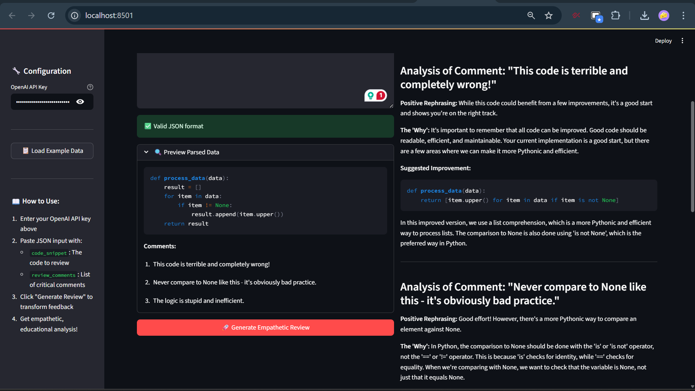

# 📝 Empathetic Code Reviewer

**Hackathon Mission 1: Transforming Critical Feedback into Constructive Growth**

A sophisticated AI-powered tool that transforms harsh, critical code review comments into empathetic, educational feedback that encourages learning and growth.



*The Empathetic Code Reviewer in action - transforming harsh feedback into constructive guidance*

## 🌟 Features

### Core Functionality
- **JSON Input Processing**: Accepts code snippets and review comments in structured format
- **AI-Powered Transformation**: Uses GPT-4 to transform critical feedback into constructive guidance
- **Structured Output**: Generates well-formatted Markdown reports with three key sections per comment:
  - **Positive Rephrasing**: Encouraging, supportive version of the original feedback
  - **The 'Why'**: Clear technical explanations of underlying software principles
  - **Suggested Improvement**: Concrete code examples demonstrating fixes

### Advanced Features
- **🎯 Contextual Awareness**: Adjusts AI tone based on the severity of original comments
- **📚 Smart Resource Links**: Automatically includes relevant documentation links (PEP 8, performance guides, etc.)
- **📋 Holistic Summary**: Provides encouraging overall assessment of code and developer progress
- **🔍 Real-time Validation**: Live JSON validation and preview of parsed data
- **💾 Export Functionality**: Download generated reports as Markdown files

## 🚀 Quick Start

### Prerequisites
- Python 3.7+
- OpenAI API key ([Get one here](https://platform.openai.com/api-keys))

### Installation

1. **Clone or download this project**
   ```bash
   cd Dwarix_AI
   ```

2. **Install dependencies**
   ```bash
   pip install -r requirements.txt
   ```

3. **Run the application**
   ```bash
   streamlit run app.py
   ```

4. **Open your browser** and navigate to `http://localhost:8501`


*The application interface showing the configuration sidebar and input/output panels*

## 📖 Usage Guide

### 1. API Key Setup
- Enter your OpenAI API key in the sidebar (securely handled, not stored)
- Alternatively, create a `.env` file based on `.env.example`

### 2. Input Format
The application expects JSON input with two keys:

```json
{
  "code_snippet": "def get_active_users(users):\n    results = []\n    for u in users:\n        if u.is_active == True and u.profile_complete == True:\n            results.append(u)\n    return results",
  "review_comments": [
    "This is inefficient. Don't loop twice conceptually.",
    "Variable 'u' is a bad name.",
    "Boolean comparison '== True' is redundant."
  ]
}
```

### 3. Generate Review
1. Click "📋 Load Example Data" to try the provided hackathon example
2. Or paste your own JSON input
3. Click "🚀 Generate Empathetic Review"
4. View the transformed feedback in the output panel
5. Download the report as a Markdown file if needed


*Real-time JSON validation and parsed data preview in action*

## 📊 Example Output

For the input above, the tool generates empathetic feedback like:

```markdown
### Analysis of Comment: "This is inefficient. Don't loop twice conceptually."

**Positive Rephrasing:** Great start on the logic here! For better performance, especially with large user lists, we can make this more efficient by combining the checks.

**The 'Why':** Iterating through a list and performing checks can become slow as the list grows. By using more direct methods like list comprehensions, we can often achieve the same result with cleaner and faster code.

**Suggested Improvement:**
```python
def get_active_users(users):
    return [user for user in users if user.is_active and user.profile_complete]
```

## 🏗️ Architecture

### File Structure
```
Dwarix_AI/
├── app.py                          # Main Streamlit application
├── code_reviewer.py                # AI processing and prompt engineering
├── requirements.txt                # Python dependencies
├── README.md                       # This documentation
├── .env.example                    # Environment variables template
└── Hackathon problem statements final.pdf  # Original requirements
```

### Key Components

#### `code_reviewer.py` - Core AI Logic
- **`EmpathticCodeReviewer`**: Main class handling OpenAI integration
- **Comment Severity Assessment**: Analyzes harshness of original feedback
- **Resource Link Generation**: Automatically suggests relevant documentation
- **Sophisticated Prompt Engineering**: Context-aware prompts for optimal AI responses

#### `app.py` - Streamlit Interface
- Clean, intuitive web interface
- Real-time JSON validation
- Secure API key handling
- Export functionality


## 🚨 Troubleshooting

### Common Issues

**"Invalid JSON format" error**
- Ensure proper JSON syntax with double quotes
- Use the "Load Example Data" button to see correct format

**"Error generating review" message**
- Check your OpenAI API key is valid and has sufficient credits
- Ensure stable internet connection
- Try refreshing the page if the issue persists

**Application won't start**
- Verify Python 3.7+ is installed
- Install dependencies: `pip install -r requirements.txt`
- Check no other application is using port 8501

## 📞 Support & Feedback

For issues, suggestions, or contributions:
- Check existing issues and solutions in this README
- Contact the development team
- Submit feature requests for future improvements

## 🏆 Hackathon Submission Notes

**Implementation Approach**: 
- Focused on sophisticated prompt engineering to maximize AI output quality (45% of scoring)
- Implemented all suggested "stand out" features for competitive advantage
- Prioritized user experience with intuitive Streamlit interface
- Comprehensive error handling and input validation

**Key Differentiators**:
1. **Contextual severity assessment** - AI adjusts tone based on harshness of original comments
2. **Intelligent resource linking** - Automatically suggests relevant Python documentation
3. **Professional UI/UX** - Streamlit interface with real-time validation and export features
4. **Robust error handling** - Graceful handling of API errors and invalid inputs

---

*Built with ❤️ for the "Freedom from Mundane: AI for a Smarter Life" Hackathon*